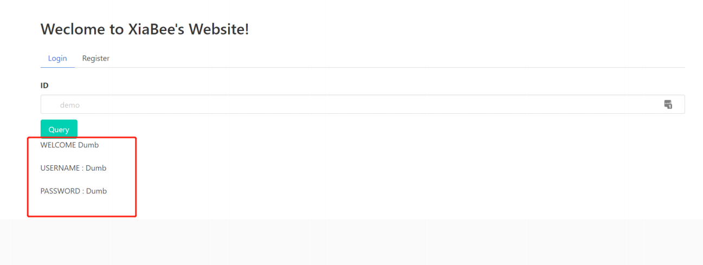

# 靶机描述


#### 靶机创建方式

* 使用`docker-compose`搭建

  ```bash
  docker-compose up -d
  chmod 777 -R www
  ```


#### 服务地址

* http://localhost:5000/index.php
* 通过`get`给`id`传参


#### 模板源码

* https://github.com/xiabee/LNMP-Docker




